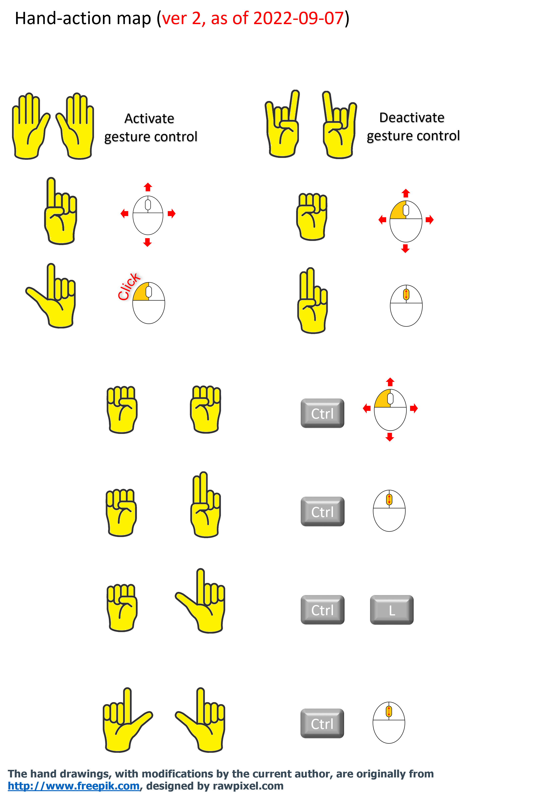

# Offline Screen Control Sharing

Let the audience control your screen with their hand gestures during your presentation. 


## Installation

Use [pip](https://pip.pypa.io/en/stable/) to install required Python packages.

```bash
pip install -r requirements.txt
```

## Usage
Execute the following command in the project's root directory:
```python
python main.py
```
The current version supports the following gestures:




More info can be found [here](./doc/presentation_materials.pptx).


## Contributing
N.B.: Maintenance is not guaranteed for this pet project. Nonetheless, pull requests are welcome. For major changes, please open an issue first to discuss what you would like to change.

## Development environment
The code has been developed with Python 3.9 on Windows 10. 
No other environments have been tested yet.

## License
[Apache License](https://www.apache.org/licenses/LICENSE-2.0.txt)
